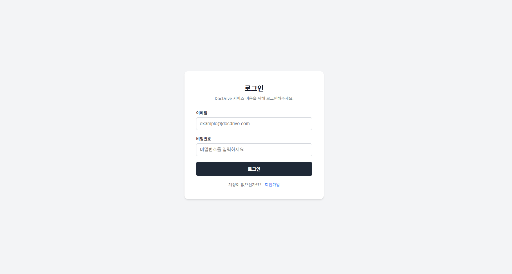
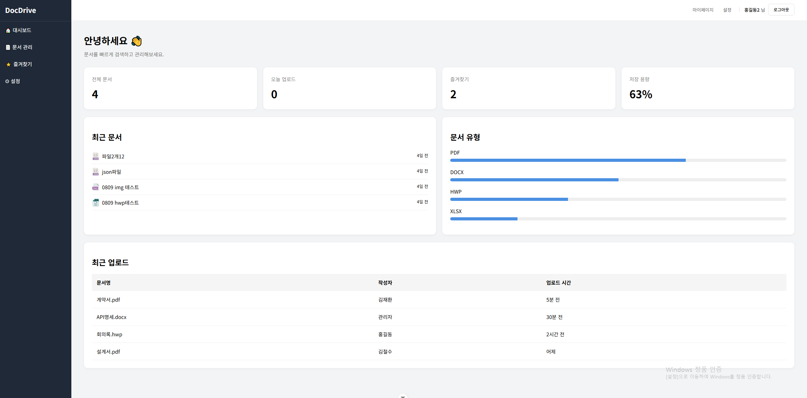
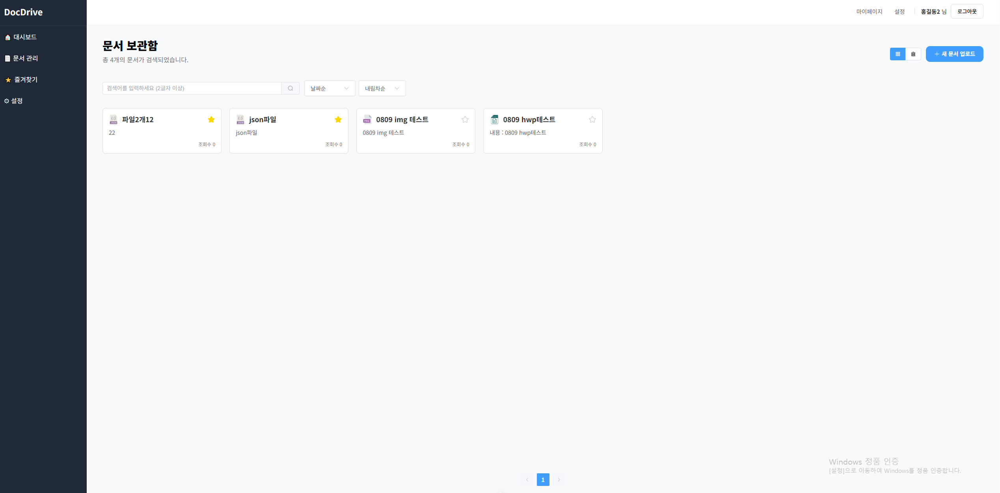
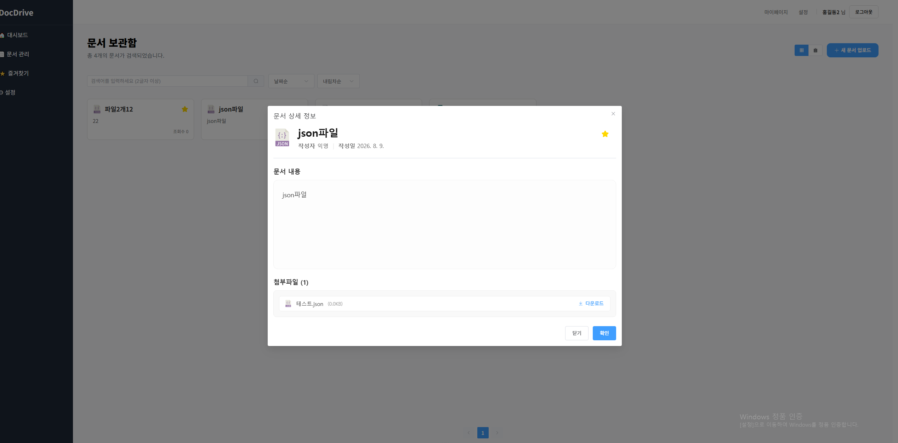
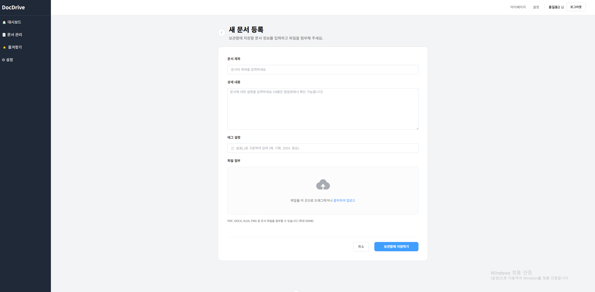

# 📚 Document Management System

> 그룹웨어 개발 및 유지보수 경험을 바탕으로 실제 업무 환경을 고려하여 직접 설계하고 개발한 문서관리 시스템입니다.

## 📌 프로젝트 소개

기업의 업무 환경에서 문서와 첨부파일을 효율적으로 관리하기 위한 웹 기반 문서관리 시스템입니다.

문서 등록, 조회, 수정, 삭제와 같은 기본적인 CRUD 기능뿐만 아니라 다음과 같은 기능을 직접 설계하고 구현했습니다.

- JWT 기반 사용자 인증
- Cookie 기반 인증 상태 관리
- 문서 등록 / 조회 / 수정 / 삭제
- 파일 업로드 및 다운로드
- Elasticsearch 기반 문서 검색
- 문서 즐겨찾기
- Dashboard
- MongoDB 기반 데이터 관리
- Cloudflare R2 기반 파일 저장

실제 그룹웨어 시스템을 개발하고 유지보수하면서 경험한 문서 관리 업무와 사용자 요구사항을 개인 프로젝트에 적용하고, Backend, Frontend, Database, Search Engine, Storage, Server 환경까지 하나의 서비스로 연결하는 것을 목표로 했습니다.

이 프로젝트는 이후 **NestJS + TypeScript + Vue 3 + TypeScript 기반으로 리빌딩한 프로젝트의 기반이 된 초기 버전**입니다.

---

# 💡 프로젝트를 시작한 이유

그룹웨어 시스템을 개발하고 유지보수하면서 다양한 고객사의 업무 환경과 요구사항을 경험했습니다.

문서 관리, 사용자 인증, 파일 처리, 검색, 데이터 관리와 같은 기능은 겉으로 보면 단순해 보일 수 있지만, 실제 업무 시스템에서는 여러 기술과 시스템이 안정적으로 연결되어야 합니다.

따라서 단순한 CRUD 프로젝트를 만드는 것보다,

> **실제 업무 시스템을 직접 설계하고 Backend, Frontend, Database, Search Engine, Storage, Server 환경까지 전체적인 구조를 구현해보자.**

라는 목표로 프로젝트를 진행했습니다.

특히 하나의 기능을 구현하는 것에 그치지 않고, 사용자가 요청을 보내고 서버가 데이터를 처리한 뒤 데이터베이스와 파일 저장소, 검색 엔진을 거쳐 다시 사용자에게 결과를 전달하는 전체적인 흐름을 직접 경험하는 것을 중요하게 생각했습니다.

---

# 👨‍💻 담당 역할

**1인 개발**

- 프로젝트 전체 구조 설계
- Vue.js 기반 Frontend 개발
- Node.js + Express.js Backend 개발
- REST API 설계 및 구현
- MongoDB 데이터 모델 설계
- Elasticsearch 검색 기능 구현
- JWT 기반 인증 구현
- Cookie 기반 인증 상태 관리
- 문서 CRUD 기능 개발
- 파일 업로드 / 다운로드 구현
- Cloudflare R2 연동
- Nginx / PM2 기반 서버 구성 및 운영

---

# 🛠️ 사용 기술

### Frontend

- `Vue.js`
- `JavaScript`
- `Pinia`
- `Vue Router`
- `Element Plus`
- `Axios`

### Backend

- `Node.js`
- `Express.js`
- `JavaScript`
- `JWT`
- `Multer`

### Database

- `MongoDB`
- `Elasticsearch`

### Storage / Infrastructure

- `Cloudflare R2`
- `Nginx`
- `PM2`
- `Linux`

### Development

- `Git`
- `GitHub`
- `Postman`
- `Swagger`

---

# 🏗️ 시스템 구성

```text
                         ┌─────────────────┐
                         │      Client     │
                         │      Vue.js     │
                         └────────┬────────┘
                                  │
                                  ▼
                         ┌─────────────────┐
                         │      Nginx      │
                         └────────┬────────┘
                                  │
                                  ▼
                    ┌─────────────────────────┐
                    │   Node.js / Express     │
                    │         Backend         │
                    └───────────┬─────────────┘
                                │
              ┌─────────────────┼─────────────────┐
              │                 │                 │
              ▼                 ▼                 ▼
       ┌────────────┐   ┌───────────────┐   ┌──────────────┐
       │  MongoDB   │   │ Elasticsearch │   │ Cloudflare R2│
       │            │   │               │   │              │
       │ 사용자     │   │ 문서 검색     │   │ 파일 저장    │
       │ 문서 정보  │   │               │   │              │
       └────────────┘   └───────────────┘   └──────────────┘
```

---

# 🗂️ 프로젝트 구조

## Backend

```text
backend/
├── routes/
├── controllers/
├── services/
├── models/
├── middleware/
└── app.js
```

## Frontend

```text
frontend/
├── src/
│   ├── assets/
│   ├── components/
│   ├── layouts/
│   ├── views/
│   ├── stores/
│   ├── router/
│   ├── App.vue
│   └── main.js
```

---

# 🔐 사용자 인증

JWT를 이용하여 사용자 인증 기능을 구현했습니다.

로그인 시 서버에서 JWT를 생성하고 Cookie에 저장하며, 인증이 필요한 요청에서는 Cookie에 저장된 JWT를 검증하여 사용자를 식별하도록 구성했습니다.

## 로그인 과정

```text
┌──────────┐
│  Login   │
└────┬─────┘
     │
     ▼
┌────────────────┐
│ Express Router │
└───────┬────────┘
        │
        ▼
┌────────────────┐
│ Auth Controller│
└───────┬────────┘
        │
        ▼
┌────────────────┐
│  Auth Service  │
└───────┬────────┘
        │
        ▼
     JWT 생성
        │
        ▼
┌────────────────────┐
│       Cookie       │
│       token        │
└─────────┬──────────┘
          │
          ▼
       Browser
```

인증이 필요한 요청에서는 Middleware에서 Cookie의 JWT를 확인하고 인증된 사용자 정보를 요청 객체에 전달하도록 구성했습니다.

```text
Request
   │
   ▼
Authentication Middleware
   │
   ▼
Cookie의 JWT 추출
   │
   ▼
JWT 검증
   │
   ▼
사용자 정보 확인
   │
   ▼
Request 진행
```

---

# 📄 문서 관리

문서와 관련된 기본적인 CRUD 기능을 구현했습니다.

### 문서 등록

문서 제목, 내용, 태그 및 첨부파일을 등록할 수 있도록 구현했습니다.

### 문서 조회

- 전체 문서 목록 조회
- 문서 상세 조회
- 최근 문서 조회
- 즐겨찾기 문서 조회

### 문서 수정

문서 제목, 내용, 태그 및 첨부파일을 수정할 수 있도록 구현했습니다.

### 문서 삭제

문서를 삭제하고 문서에 연결된 파일 정보도 함께 관리하도록 구성했습니다.

### 즐겨찾기

자주 사용하는 문서를 즐겨찾기로 등록하고 별도의 목록에서 확인할 수 있도록 구현했습니다.

---

# 📁 파일 관리

문서 정보와 실제 파일 데이터를 분리하여 관리했습니다.

```text
             문서 등록
                 │
                 ▼
        ┌────────────────┐
        │ Node / Express │
        └───────┬────────┘
                │
          ┌─────┴─────┐
          │           │
          ▼           ▼
      MongoDB      Cloudflare R2
          │           │
          │           └── 실제 파일
          │
          └── 파일 메타데이터
```

MongoDB에는 실제 파일을 저장하지 않고 파일의 메타데이터를 저장합니다.

- 파일명
- 파일 크기
- 파일 확장자
- 파일 URL
- fileKey

실제 파일은 Cloudflare R2에 저장하여 애플리케이션 서버와 파일 저장 영역을 분리했습니다.

이를 통해 서버의 디스크 공간에 대한 의존도를 줄이고 파일 저장 영역을 독립적으로 구성했습니다.

---

# ☁️ Cloudflare R2

파일 저장을 애플리케이션 서버와 분리하기 위해 **Cloudflare R2를 Object Storage로 사용**했습니다.

```text
Client
   │
   ▼
Express API
   │
   ├── 문서 정보
   │       ↓
   │    MongoDB
   │
   └── 실제 파일
           ↓
      Cloudflare R2
```

문서 데이터와 실제 파일 데이터를 분리함으로써 애플리케이션 서버가 파일 저장소 역할까지 담당하지 않도록 구성했습니다.

---

# 🔎 Elasticsearch 검색

MongoDB의 일반적인 조회와 별도로 Elasticsearch를 사용하여 문서 검색 기능을 구현했습니다.

```text
사용자
  │
  │ 검색어
  ▼
Vue.js
  │
  ▼
Express API
  │
  ▼
Elasticsearch
  │
  ▼
검색 결과
  │
  ▼
Vue.js
```

문서 제목을 기준으로 검색하도록 구성했으며 Elasticsearch Query를 이용하여 검색 결과를 반환하도록 구현했습니다.

검색 방식에 따라 `match`, `wildcard` 등의 Query를 적용하면서 검색 결과를 개선했습니다.

---

# 📊 Dashboard

문서관리 시스템의 주요 정보를 한눈에 확인할 수 있도록 Dashboard를 구현했습니다.

- 전체 문서 수
- 오늘 업로드된 문서 수
- 즐겨찾기 문서 수
- 최근 문서

Dashboard 데이터는 Backend API에서 MongoDB의 문서 데이터를 조회하여 집계하도록 구성했습니다.

```text
┌─────────────────┐
│ 전체 문서       │
│      125        │
└─────────────────┘

┌─────────────────┐
│ 오늘 업로드     │
│       8         │
└─────────────────┘

┌─────────────────┐
│ 즐겨찾기        │
│       23        │
└─────────────────┘
```

---
## 📸 주요 화면

### Login



### Dashboard



### Document List



### Document Detail



### Upload


